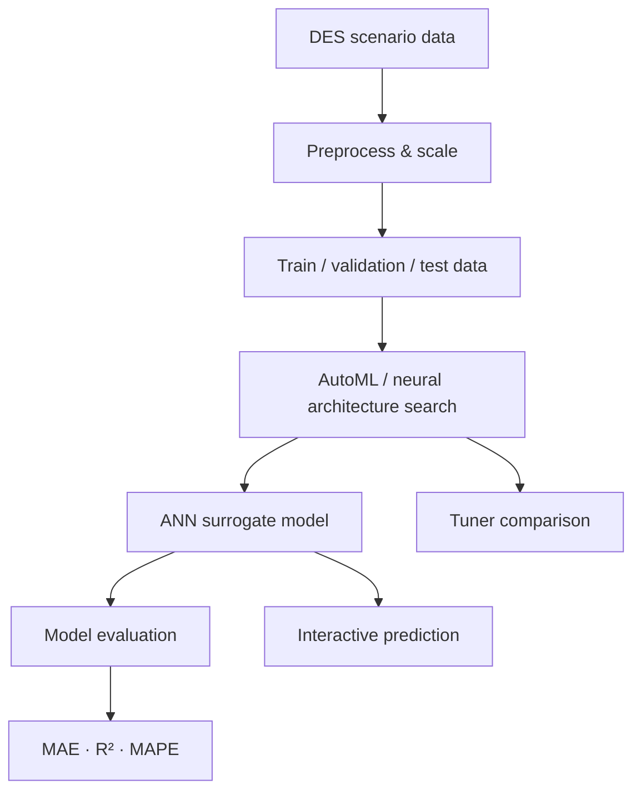

# SimApproximation-ML

**Learning-based surrogate modeling for discrete-event simulation in remanufacturing**

SimApproximation-ML is an academic research prototype that explores whether an artificial neural network can act as a surrogate for a discrete-event simulation (DES) of a remanufacturing system. The goal is to learn the relationship between simulation settings and system-level KPIs so candidate scenarios can be evaluated without running the full simulation every time.

The repository contains the complete ML-side workflow: preprocessing, neural architecture search, model training and evaluation, prediction, post-processing, and a lightweight desktop GUI.

## Project pipeline



## What this project demonstrates

- **Simulation-to-ML workflow** — formulates DES approximation as supervised multi-output regression.
- **Automated model search** — compares Random Search, Hyperband, Greedy, and Bayesian tuner strategies through AutoKeras.
- **End-to-end evaluation** — inverse-transforms predictions and evaluates them in the original KPI scale.
- **Experiment analysis** — extracts tuner trial results and compares validation error with search cost.
- **Usable research tooling** — wraps preprocessing, training, evaluation, and prediction in a Tkinter interface.

## Problem formulation

The current prototype maps **four simulation scenario parameters** to **ten production-system KPIs**, including utilization, flow time, OEE, queue length, processing and waiting times, and throughput.

The exact parameter names are specific to the original research simulation and are intentionally treated as implementation details rather than the main focus of the project.

<details>
<summary><strong>Show configured input and output fields</strong></summary>

### Inputs

- `AmountServer`
- `Coolingdefect`
- `InterarrivalTime`
- `defekteModulanzahl`

### Outputs

- `AverageServerUtilisation`
- `AverageFlowTime`
- `OEE`
- `TotalAverageQueueLength`
- `ProcessingTimeAverage`
- `WaitingTimeAverage`
- `MovingTimeAverage`
- `FailedTimeAverage`
- `BlockedTimeAverage`
- `Throughput`

</details>

## Model search and evaluation

The surrogate model is implemented with AutoKeras `StructuredDataRegressor`. For each tuner strategy, the framework can:

1. search candidate network architectures,
2. train candidate models,
3. record search and training time,
4. load the best exported model,
5. evaluate predictions after inverse scaling,
6. compare tuner behavior during post-processing.

The project uses MAE and R² as general regression metrics and reports MAPE where meaningful. Percentage errors require care for targets at or near zero, so per-KPI evaluation remains important.

## Repository structure

```text
.
├── main.py                         # Tkinter application and end-to-end workflow
├── module_data_preprocessing.py    # JSON parsing, cleaning, scaling, splitting
├── module_automl.py                # AutoKeras search, training, evaluation, prediction
├── module_data_postprocessing.py   # Trial analysis and visualization
├── environment.yml                 # Reproducible Python environment
├── User_Guide.pdf                  # Usage guide for the prototype
├── LICENSE
└── README.md
```

## Setup

The original project was developed with Python 3.10 and a TensorFlow/AutoKeras stack from 2024.

```bash
conda env create -f environment.yml
conda activate sim-approximation-ml
python main.py
```

> **Compatibility note:** TensorFlow and AutoKeras version compatibility can be sensitive on newer Python, CUDA, and operating-system stacks. The environment file keeps the original major package versions instead of tracking the latest releases.

## Typical workflow

1. Select one or more simulation JSON files.
2. Mark each dataset as `train`, `test`, or `split`.
3. Run preprocessing and choose MinMax or Standard scaling.
4. Start AutoML search and model training.
5. Evaluate trained models on held-out scenarios.
6. Compare search strategies and inspect generated plots.
7. Load a selected model for interactive prediction.

## Scope and limitations

This repository is a **research prototype**, not a production inference service.

- The underlying DES model and research datasets are not included.
- Predictive quality is KPI-dependent; a single aggregate error does not characterize every output equally well.
- MAPE is not robust for zero or near-zero targets, so MAE/R² and per-KPI inspection remain important.
- The current implementation uses fixed parameter names from the original study rather than a fully schema-driven configuration.
- AutoML search can be computationally expensive because tuner strategies may train many candidate networks.

## Research context

This implementation was developed by **Haoling Yang** as part of an academic research project at RWTH Aachen University on machine-learning approximation of discrete-event simulation in remanufacturing.

The associated research report and underlying simulation artifacts are intentionally **not redistributed in this public repository**. This repository focuses on the software implementation and reproducible workflow.

## License

This repository is released under the MIT License. See [LICENSE](LICENSE).
