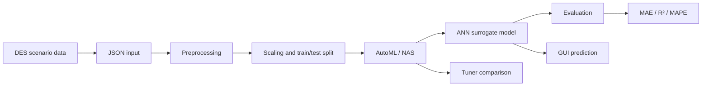

# SimApproximation-ML

**Learning-based surrogate modeling for discrete-event simulation in remanufacturing**

SimApproximation-ML is an academic research prototype that explores whether an artificial neural network can act as a surrogate for a discrete-event simulation (DES) of a remanufacturing system. The goal is to learn the relationship between simulation inputs and system-level KPIs so that candidate scenarios can be evaluated without running the full simulation every time.

The repository contains the implementation of the ML workflow: data preprocessing, neural architecture search, model training and evaluation, prediction, post-processing, and a lightweight desktop GUI.

## Project pipeline



## What this project demonstrates

- **Simulation-to-ML workflow** — converts DES scenario outputs into a supervised regression problem.
- **Multi-output regression** — predicts several production-system KPIs from a shared set of scenario parameters.
- **Automated architecture search** — compares Random Search, Hyperband, Greedy, and Bayesian tuner strategies through AutoKeras.
- **Evaluation in the original output scale** — inverse-transforms predictions before computing regression metrics.
- **Experiment post-processing** — extracts tuner trial data and visualizes validation error and search-time trade-offs.
- **End-to-end interface** — provides a Tkinter GUI for preprocessing, training, evaluation, prediction, and result inspection.

## Repository structure

```text
.
├── main.py                         # Tkinter application and end-to-end workflow
├── module_data_preprocessing.py    # JSON parsing, cleaning, scaling, splitting
├── module_automl.py                # AutoKeras search, training, evaluation, prediction
├── module_data_postprocessing.py   # Trial analysis and visualization
├── environment.yml                 # Reproducible Python environment
├── User_Guide.pdf                  # Usage guide for the prototype
├── LICENSE
└── README.md
```

## Inputs and outputs

The current implementation is configured around four simulation inputs:

- `AmountServer`
- `Coolingdefect`
- `InterarrivalTime`
- `defekteModulanzahl`

and predicts ten system-level outputs:

- `AverageServerUtilisation`
- `AverageFlowTime`
- `OEE`
- `TotalAverageQueueLength`
- `ProcessingTimeAverage`
- `WaitingTimeAverage`
- `MovingTimeAverage`
- `FailedTimeAverage`
- `BlockedTimeAverage`
- `Throughput`

These names reflect the original research simulation and can be adapted in the preprocessing and GUI configuration for other DES datasets.

## AutoML workflow

The surrogate model is implemented with AutoKeras `StructuredDataRegressor`. For each tuner strategy, the framework can:

1. search candidate network architectures,
2. train the candidate models,
3. record search/training time,
4. load the best exported model,
5. evaluate predictions after inverse scaling,
6. compare tuner behavior during post-processing.

The project uses MAE and R² as general regression metrics and also reports MAPE where meaningful. Percentage errors should be interpreted carefully for targets at or near zero.

## Setup

The original project was developed with Python 3.10 and a TensorFlow/AutoKeras stack from 2024.

```bash
conda env create -f environment.yml
conda activate sim-approximation-ml
python main.py
```

> **Compatibility note:** TensorFlow and AutoKeras version compatibility can be sensitive on newer Python, CUDA, and operating-system stacks. The environment file intentionally keeps the original major package versions instead of tracking the latest releases.

## Typical workflow

1. Select one or more simulation JSON files in the GUI.
2. Mark each dataset as `train`, `test`, or `split`.
3. Run preprocessing and choose MinMax or Standard scaling.
4. Start the AutoML search and model training.
5. Evaluate trained models on held-out simulation scenarios.
6. Compare search strategies and inspect generated plots.
7. Load a selected model and run interactive predictions from the GUI.

## Scope and limitations

This repository is a **research prototype**, not a production inference service.

- The underlying DES model and research datasets are not included.
- Predictive quality is KPI-dependent; a single aggregate error does not characterize every output equally well.
- MAPE is not robust for zero or near-zero targets, so MAE/R² and per-KPI inspection remain important.
- The current implementation uses fixed parameter names from the original study rather than a fully schema-driven configuration.
- AutoML search can be computationally expensive because tuner strategies may train many candidate networks.

## Research context

This implementation was developed by **Haoling Yang** as part of an academic research project at RWTH Aachen University on machine-learning approximation of discrete-event simulation in remanufacturing.

The associated research report and underlying simulation artifacts are intentionally **not redistributed in this public repository**. This repository focuses on the software implementation and reproducible workflow.

## License

This repository is released under the MIT License. See [LICENSE](LICENSE).
